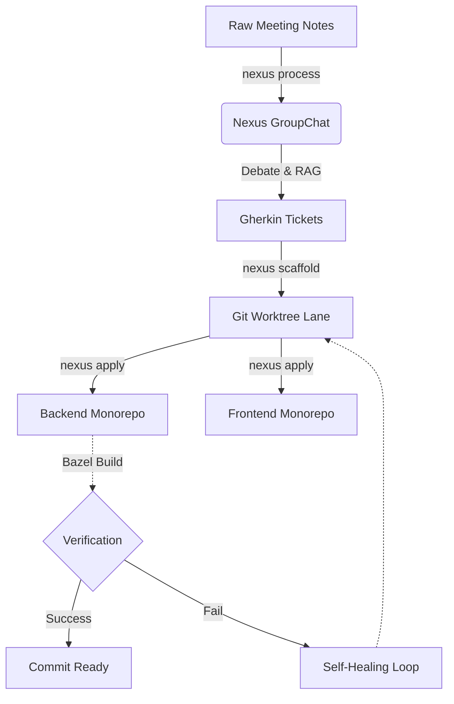

# Nexus: Examples & Workflows

This document outlines the standard Forward Deployed Engineering (FDE) workflows using the **Nexus** orchestrator.

## The Autonomous FDE Lifecycle



---

## 1. Processing Raw Notes (`nexus process`)

Top-tier FDEs take chaotic client meetings and instantly turn them into actionable engineering tickets. The new architecture uses an interactive GroupChat where the Architect stress-tests the PM's spec before anything is written to Linear.

**The Input (`client_meeting.md`):**
```markdown
# Sync with Acme Corp
They really need the dashboard to load faster. It's taking like 10 seconds.
Also, add a green/red status indicator for campaign health. Budget pacing is a must.
```

**The Command:**
```bash
$ nexus process client_meeting.md --interactive
```

**Console Output:**
```text
[Discovery_Agent] Outputting drafted Product Spec based on meeting...
[Architect_Agent] REJECTED. The spec fails to account for rate limits on the pacing API. Please revise.
[Discovery_Agent] Revised Product Spec accounting for rate limits and caching...
[Architect_Agent] ARCHITECTURE APPROVED.
[User_Proxy] Terminal paused. Proceed with ticket creation? (y/n): y
[Ticket_Agent] Executing tool: create_linear_ticket("Frontend - Health Status Indicators")
```

---

## 2. Code Scaffolding (`nexus scaffold`)

Once the tickets are approved, Nexus delegates to the FDE Scaffolder agent to write the code natively into an isolated, airgapped Git worktree.

**The Command:**
```bash
$ nexus scaffold CMS-4953
```

**Console Output:**
```text
[Nexus] Initializing Gemini 3.1 Pro via Vertex AI...
[Scaffolder] Analyzing CMS-4953 for architectural constraints...
[Scaffolder] Executing tool: git_worktree_add("CMS-4953")
[Scaffolder] Executing tool: write_file("backend/api/feedback.proto")
[Scaffolder] Executing tool: write_file("frontend/src/feedback.service.ts")
✅ Scaffold generated safely in .fde/worktrees/CMS-4953/
```

---

## 3. Applying and Verifying (`nexus apply`)

Nexus moves the code from the worktree sandbox to the real monorepos and runs a strict verification loop.

**The Command:**
```bash
$ nexus apply CMS-4953
```

**Console Output:**
```text
Ready to apply scaffold from: /home/gio/nexus/.fde/worktrees/CMS-4953
This will copy files to your ~/workspace/ monorepos.

Do you want to proceed? [y/N]: y
[✓] Copied backend files...
[✓] Copied frontend files...

Running Bazel Build Verification in backend...
$ bazel run //:gazelle
$ bazel build //...
INFO: Analyzed 42 targets (0 packages loaded, 0 targets configured).
INFO: Found 42 targets...
✅ Build completed successfully.
🎉 Nexus deployment verified. Ready for commit.
```
